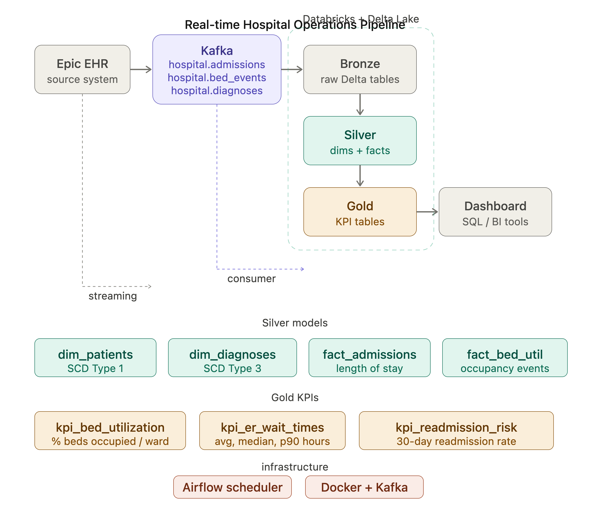

# Real-time Hospital Operations Pipeline

> A production-grade data engineering pipeline that streams live hospital events into Databricks Delta Lake — delivering real-time KPI dashboards for bed utilization, ER wait times, and 30-day readmission risk.



---

## Overview

Hospitals generate thousands of events every hour — patient admissions, bed status changes, diagnosis updates. This pipeline captures those events in real time via Kafka, lands them in Databricks Delta Lake through a Bronze → Silver → Gold medallion architecture, and surfaces actionable KPIs for hospital operations teams.

Built with the same patterns used by real healthcare data engineering teams: SCD Type 1 and Type 3 for slowly changing dimensions, PySpark for distributed transformation, and Delta Lake for ACID-compliant storage.

---

## Tech stack

| Layer | Tool | Purpose |
|---|---|---|
| Source | Epic EHR (simulated) | Patient admissions, bed events, diagnoses |
| Streaming | Apache Kafka | Real-time event ingestion, 3 topics |
| Storage | Databricks Delta Lake | Bronze / Silver / Gold medallion tables |
| Transform | PySpark notebooks | SCD Type 1 & 3, KPI aggregations |
| Orchestration | Apache Airflow | Daily pipeline scheduling at 6am |
| Infrastructure | Docker | Local Kafka + Kafka UI for development |
| Language | Python 3.9+ | Producers, consumer, data generator |

---

## Architecture

```
Epic EHR (simulated via Faker)
          │
          ▼
    Kafka Topics
    ├── hospital.admissions    (patient admit / discharge events)
    ├── hospital.bed_events    (bed occupancy status changes)
    └── hospital.diagnoses     (ICD-10 diagnosis records)
          │
          ▼  (Kafka consumer → Databricks SQL API)
          │
    ┌─────────────────────────────────┐
    │     Databricks Delta Lake       │
    │                                 │
    │  BRONZE (raw, unchanged)        │
    │  ├── bronze_admissions          │
    │  ├── bronze_bed_events          │
    │  └── bronze_diagnoses           │
    │            │                    │
    │            ▼  (PySpark)         │
    │  SILVER (cleaned + typed)       │
    │  ├── dim_patients  (SCD Type 1) │
    │  ├── dim_diagnoses (SCD Type 3) │
    │  ├── dim_physicians             │
    │  ├── fact_admissions            │
    │  └── fact_bed_utilization       │
    │            │                    │
    │            ▼  (PySpark)         │
    │  GOLD (KPI aggregates)          │
    │  ├── kpi_bed_utilization        │
    │  ├── kpi_er_wait_times          │
    │  └── kpi_readmission_risk       │
    └─────────────────────────────────┘
          │
          ▼
    BI Dashboard / SQL Editor
```

---

## KPIs delivered

| KPI | Business question | Method |
|---|---|---|
| **Bed utilization** | What % of beds are occupied per ward per day? | Aggregated from bed status events |
| **ER wait times** | How long are patients spending in the ER? | Avg, median, p90 of length of stay |
| **30-day readmission** | Which wards have the highest readmission rate? | PySpark `LAG()` over patient discharge history |

---

## Project structure

```
realtime-hospital-ops-pipeline/
│
├── .env.example                      ← credentials template (safe to commit)
├── .gitignore                        ← excludes .env, venv/, __pycache__
├── requirements.txt                  ← all Python dependencies
├── docker-compose.yml                ← local Kafka + Kafka UI
│
├── config/
│   └── settings.py                   ← reads .env, single config object for whole project
│
├── data/
│   ├── generate_sample_data.py       ← generates realistic fake hospital events via Faker
│   └── sample/                       ← generated JSON files (admissions, bed_events, diagnoses)
│
├── kafka/
│   ├── producer/
│   │   ├── admission_producer.py     ← sends admission events to Kafka
│   │   ├── bed_event_producer.py     ← sends bed status events to Kafka
│   │   ├── diagnosis_producer.py     ← sends diagnosis events to Kafka
│   │   └── streaming_producer.py     ← continuous real-time producer (fires every few seconds)
│   └── consumer/
│       └── databricks_consumer.py    ← reads all 3 Kafka topics → writes to Bronze Delta tables
│
├── databricks/
│   ├── connection/
│   │   └── client.py                 ← get_client() — single reusable Databricks SDK connection
│   └── notebooks/
│       ├── 01_setup_bronze.py        ← creates Delta Lake database + all Bronze tables (run once)
│       ├── 02_silver.py              ← Bronze → Silver: SCD Type 1, SCD Type 3, fact tables
│       └── 03_gold.py                ← Silver → Gold: KPI aggregations for dashboards
│
├── airflow/
│   └── dags/
│       └── hospital_pipeline_dag.py  ← orchestrates full pipeline daily at 6am
│
└── docs/
    └── architecture.svg              ← pipeline architecture diagram
```

---

## Quickstart

### Prerequisites
- Python 3.9+
- Docker Desktop (for local Kafka)
- Databricks Community Edition account — [sign up free](https://community.cloud.databricks.com)

### 1 — Clone and set up virtual environment
```bash
git clone https://github.com/karansalunkhe21/realtime-hospital-ops-pipeline.git
cd realtime-hospital-ops-pipeline

python -m venv venv
source venv/bin/activate        # Windows: venv\Scripts\activate

# Set Python path (required)
export PYTHONPATH=/path/to/realtime-hospital-ops-pipeline

pip install -r requirements.txt
```

### 2 — Configure credentials
```bash
cp .env.example .env
# Open .env and fill in:
# DATABRICKS_HOST   — your workspace URL (e.g. https://dbc-xxxxx.cloud.databricks.com)
# DATABRICKS_TOKEN  — personal access token from Settings → Access Tokens
# DATABRICKS_CLUSTER_ID — from Compute → your cluster URL
```

### 3 — Start Kafka locally
```bash
docker-compose up -d
# Kafka runs on localhost:9092
# Kafka UI available at http://localhost:8080
```

### 4 — Set up Bronze tables in Databricks (run once)
1. Open Databricks workspace → `+ New` → `Notebook`
2. Paste contents of `databricks/notebooks/01_setup_bronze.py`
3. Click `Run All`

Expected output:
```
✅ Database 'hospital' ready
✅ bronze_admissions table ready
✅ bronze_bed_events table ready
✅ bronze_diagnoses table ready
```

### 5 — Generate sample data
```bash
python data/generate_sample_data.py
# Creates 100 records each for admissions, bed_events, diagnoses
```

### 6 — Send events to Kafka

**Option A — batch (send 100 events once):**
```bash
python kafka/producer/admission_producer.py
python kafka/producer/bed_event_producer.py
python kafka/producer/diagnosis_producer.py
```

**Option B — real-time streaming (fires continuously):**
```bash
python kafka/producer/streaming_producer.py
# Sends a new admission every 5-10s, bed event every 2-3s, diagnosis every 8-15s
# Press Ctrl+C to stop
```

### 7 — Land data in Databricks Bronze
```bash
# Open a second terminal, activate venv, then:
python kafka/consumer/databricks_consumer.py
# Listens continuously — press Ctrl+C when done
```

### 8 — Build Silver and Gold layers in Databricks
1. Create notebook `02_silver` → paste `databricks/notebooks/02_silver.py` → Run All
2. Create notebook `03_gold` → paste `databricks/notebooks/03_gold.py` → Run All

### 9 — Query your KPIs
In Databricks SQL Editor:
```sql
-- Bed utilization by ward
SELECT * FROM hospital.kpi_bed_utilization
ORDER BY report_date DESC, utilization_pct DESC;

-- ER wait times
SELECT * FROM hospital.kpi_er_wait_times
ORDER BY report_date DESC;

-- 30-day readmission risk
SELECT * FROM hospital.kpi_readmission_risk
ORDER BY report_date DESC, readmission_rate_pct DESC;
```

---

## Key concepts explained

### Medallion architecture
Data moves through three quality layers — each layer has a clear contract:
- **Bronze** — raw data, stored exactly as received from Kafka. Never modified. Full JSON also stored in `raw_json` column for auditability.
- **Silver** — cleaned, typed, deduplicated. Timestamps cast to proper types, length of stay calculated, duplicates removed with `ROW_NUMBER()`.
- **Gold** — aggregated KPIs ready for dashboards. One row per ward per day.

### SCD Type 1 — `dim_patients`
Always keeps only the **latest** patient demographics. When a patient's insurance type or address changes, the old value is overwritten. Implemented with `ROW_NUMBER() OVER (PARTITION BY patient_id ORDER BY admit_timestamp DESC)` — only row 1 is kept.

### SCD Type 3 — `dim_diagnoses`
Keeps **both** the original and current diagnosis in the **same row**:
```
patient_id | original_diagnosis_code | current_diagnosis_code | diagnosis_was_revised
PT12345    | I21.0                   | J18.9                  | true
```
Critical for readmission analysis — you can tell at a glance if a patient's diagnosis was ever revised between admissions.

### 30-day readmission
Uses PySpark `LAG()` to look back at each patient's previous discharge:
```python
LAG("discharge_ts").over(Window.partitionBy("patient_id").orderBy("admit_ts"))
```
Any admission within 30 days of the previous discharge is flagged as a readmission. Hospitals face financial penalties from CMS for high readmission rates, making this a high-stakes metric.

### Real-time streaming producer
`streaming_producer.py` fires events at realistic intervals matching a real hospital:
- Bed status change: every 2-3 seconds (beds change constantly)
- Patient admission: every 5-10 seconds
- Diagnosis record: every 8-15 seconds

---

## Commit history

| # | Commit message | What it covers |
|---|---|---|
| 1 | `chore: project setup with config, gitignore and requirements` | `.env.example`, `.gitignore`, `requirements.txt`, `README.md`, `docker-compose.yml` |
| 2 | `feat: add config settings and sample data generator` | `config/`, `data/` |
| 3 | `feat: add Kafka producers for admissions, bed events and diagnoses` | `kafka/producer/` |
| 4 | `feat: add Kafka consumer that lands data into Databricks Bronze` | `kafka/consumer/` |
| 5 | `feat: add Databricks client and Bronze Delta table setup` | `databricks/connection/`, `databricks/notebooks/01_setup_bronze.py` |
| 6 | `feat: silver layer with SCD Type 1 and SCD Type 3 transforms` | `databricks/notebooks/02_silver.py` |
| 7 | `feat: gold layer KPIs for bed utilization, ER wait times and readmission risk` | `databricks/notebooks/03_gold.py` |
| 8 | `feat: Airflow DAG to orchestrate full pipeline daily at 6am` | `airflow/` |
| 9 | `feat: add real-time streaming producer` | `kafka/producer/streaming_producer.py` |
| 10 | `docs: add architecture diagram to README` | `docs/architecture.svg` |

---

## Environment variables

| Variable | Description | Example |
|---|---|---|
| `DATABRICKS_HOST` | Workspace URL | `https://dbc-xxxxx.cloud.databricks.com` |
| `DATABRICKS_TOKEN` | Personal access token | `dapi1234abcd...` |
| `DATABRICKS_CLUSTER_ID` | Cluster or warehouse ID | `abc123def456` |
| `KAFKA_BOOTSTRAP_SERVERS` | Kafka broker address | `localhost:9092` |
| `KAFKA_TOPIC_ADMISSIONS` | Admissions topic name | `hospital.admissions` |
| `KAFKA_TOPIC_BED_EVENTS` | Bed events topic name | `hospital.bed_events` |
| `KAFKA_TOPIC_DIAGNOSES` | Diagnoses topic name | `hospital.diagnoses` |

---

## License

MIT